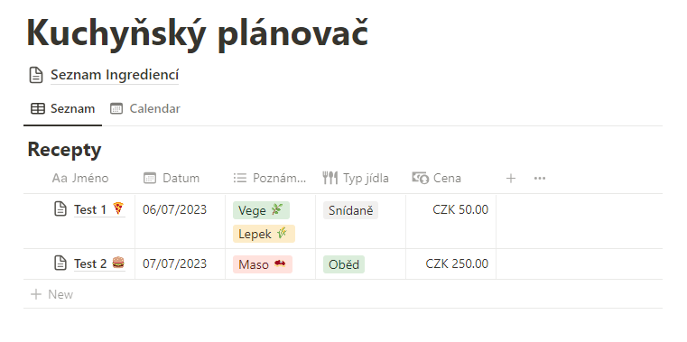
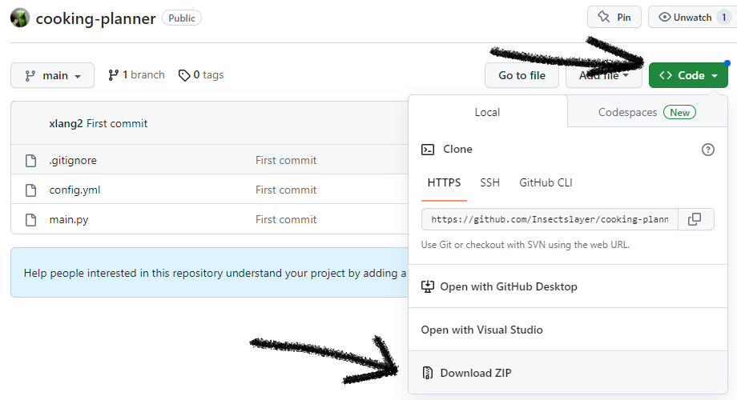
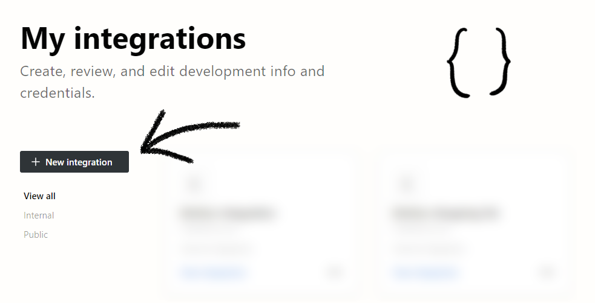
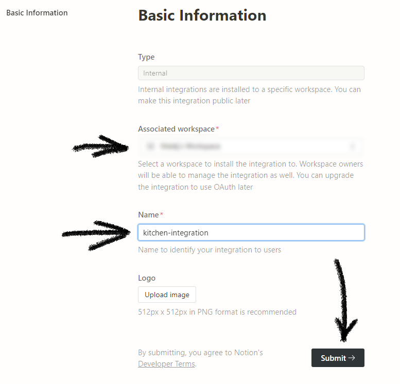
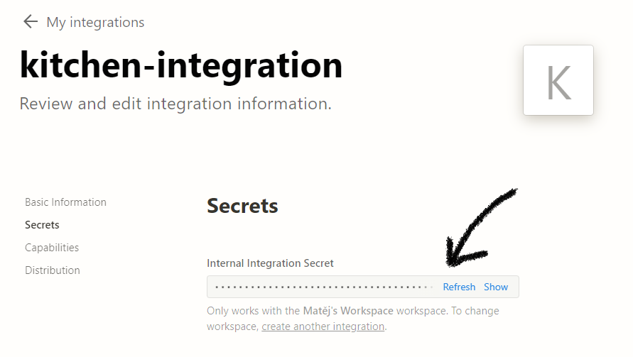
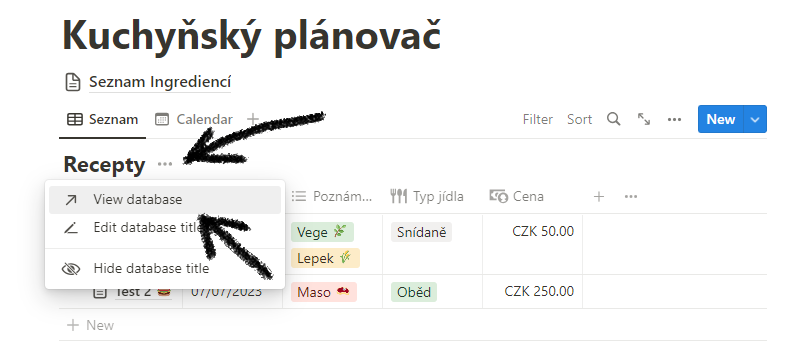
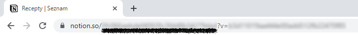

# Kuchyňský plánovač

Tento skript slouží jako doplněk pro [kuchyňskou databázi](https://indecisive-triangle-57b.notion.site/Kuchy-sk-pl-nova-34a3aaf74e01488cae0b449958a51f0f) v Notionu. Skript plní dvě úlohy, které je obtížné způsobit přímo v Notionu.

První z nich je přepočet aktuální ceny receptu v závislosti na jeho ingrediencích. Druhým úkolem je vytvoření nákupního seznamu ve formátu csv, určeného k vytištění.

## Použití

Stáhněte si obsah repozitáře k sobě na počítač. Pokud s gitem neumíte, stačí si stáhnout vše jako zip a robalit.

Po stažení programu otevřete `config.yml`, vložíte do něj příslušné informace.

Zkopírujte si [šablonu](https://indecisive-triangle-57b.notion.site/Kuchy-sk-pl-nova-34a3aaf74e01488cae0b449958a51f0f) do vlastního Notionu a připojte k němu integraci.

### Integrace

Integrace je robotický účet, přes který bude program komunikovat s kuchyňskou databází. Novou integraci si vytvoříte [zde](https://www.notion.so/my-integrations).

Ujistěte se, že je vybraný stejný workspace, ve kterém žije váš plánovač. Pojmenujte si integraci a potvrďte.

Na další stránce si zkopírujte "Internal Integration Secret". To je `api_token`, který uložíte do `config.yml`.

**`api_token` je heslo, se kterým má program přístup k Notion databázi. Proto se k němu chovejte jako k heslu a nikde ho nezveřejňujte!**

### Database ID

V Notion má každá databáze své unikátní označení. Program tato označení potřebuje znát, aby k databázi mohl přistoupit a upravit ji.

Otevřete databázi receptů v novém okně.

Zkopírujte označený text do `config.yml` jako `recipes_db_id`.

Stejně otevřete "Seznam Ingrediencí" a uložte ID do `master_ingredients_db_id`.
